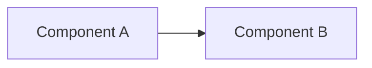

<!--
Template usage notes (delete this block in real designs):

- Design docs sit between **DDD** (`docs/domain-driven-design/` — what the
  domain looks like) and **plans** (`docs/plans/` — pending — what the agent
  should code). They answer **how** the BCC + ADC are realised in code.
- Optimised for two readers: humans approving the implementation strategy,
  and agents generating implementation plans + code.
- A design doc must be **agent-executable**: file paths, exact interfaces,
  exact SQL, exact API contracts. Prose-only designs do not count as done.
- Cite the PRDs, ADRs, BCCs, ADCs you implement. Don't restate them.
- Each design owns its own ID space for any sub-IDs it introduces (e.g.,
  table names, function names) — but those are not stable cross-doc IDs;
  cite by full path/name when referencing across designs.
- Keep one design per coherent component or capability. If your design
  exceeds ~600 lines or introduces decisions for two unrelated things,
  split it. (Mirror of the PRD-template "30-50 R-NN" splitting heuristic.)
-->

## 1. Purpose

One paragraph. What component or capability does this design realise, and
which PRDs / DDD artifacts does it implement? End with the one-sentence
"this design succeeded if…" criterion.

> **Realises:** PRD-NNN R-NN..R-NN; BCC-NN §X; ADC-NN.
> **Definition of success:** an implementation agent can pick up this design
> and produce code that passes the cited ACs without further product or
> domain decisions.

## 2. Scope

### 2.1 In scope

- …

### 2.2 Out of scope (owned by other designs)

| Concern | Owned by | Reason |
|---------|----------|--------|
| … | DESIGN-NNN | … |

## 3. Architecture

High-level shape — what the components are, how they relate, where they live in the codebase. A diagram is encouraged (Mermaid `flowchart`, `classDiagram`, or `sequenceDiagram`).



Or describe the layout:

```
packages/
  domain/
    job-state-machine.ts
    roles.ts
  db/
    schema/
      jobs.ts
      users.ts
  api/
    routers/
      jobs.ts
```

## 4. Detailed design

Per-component design. Each subsection covers one file or module.

### 4.1 `<file path>`

- **Purpose:** …
- **Public interface:**

  ```ts
  export interface ExampleAPI {
    method(arg: Type): ReturnType;
  }
  ```

- **Key behaviours:** numbered list of the non-trivial behaviours, each citing a PRD R-NN or AC-NN.
- **Dependencies:** what this file imports from / depends on.
- **Notes:** edge cases, performance considerations, failure modes.

### 4.2 `<next file>`

…

## 5. Migration / data shape *(when applicable — schema-touching designs)*

Concrete schema (SQL, Drizzle, etc.) including indexes, constraints, triggers. Migration steps numbered if order matters.

```sql
CREATE TABLE example (
  id uuid PRIMARY KEY DEFAULT gen_random_uuid(),
  ...
);

CREATE INDEX idx_example_foo ON example(foo);
```

## 6. API contracts *(when applicable — boundary-touching designs)*

Exact procedure signatures, HTTP routes, or event payloads. Each API contract cites the PRD CMD-NN / Q-NN / EVT-NN it serves.

```ts
// CMD-NN from BCC-NN
export const exampleProcedure = authProc({ input: ExampleInput })
  .mutation(async ({ ctx, input }) => { ... });
```

## 7. Error handling

How failures surface — error codes, status codes, UI surfacing.

| Error | Source | Status / code | Surface |
|-------|--------|----------------|---------|
| … | … | 4XX | toast + inline |

## 8. Testing approach

What tests this design demands and where they live. Aligned to the PRD ACs the design realises.

- **Unit:** `packages/domain/__tests__/...`
- **Integration:** `packages/api/__tests__/...` (against real Postgres via testcontainers, per project test-DB rule)
- **E2E:** `apps/web/e2e/...` (post-walking-skeleton)

Coverage target: every PRD AC mapped to at least one passing test.

## 9. Open questions

| ID | Question | Owner | Needed by |
|----|----------|-------|-----------|
| Q-DSG-01 | … | … | YYYY-MM-DD |

## 10. Changelog

| Date | Author | Change |
|------|--------|--------|
| YYYY-MM-DD | … | Initial draft |
