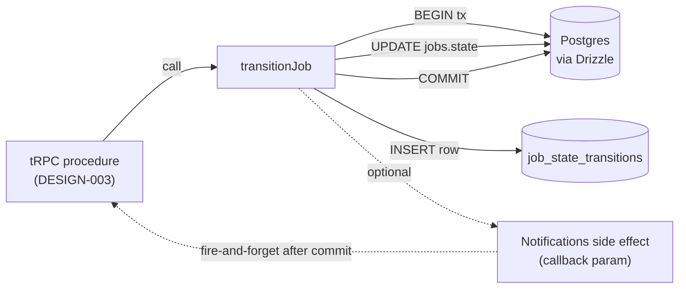

## 1. Purpose

Realises ADR-008's hand-rolled TypeScript FSM. Defines the `transitionJob()` helper that mutates `jobs.state` and writes the corresponding `job_state_transitions` row in one Drizzle transaction, plus the parallel `transitionRole()` helper for the user-role transitions covered by PRD-008. **All callers across PRDs 002, 004, 005, 006, 008 funnel through these helpers** — there are no direct `state` / `role` column writes elsewhere in the codebase, and (per §4.1.5) no direct `INSERT INTO job_state_transitions` either: `recordRelationshipEvent()` is the single helper for non-FSM events (enroll / unenroll) that still need an audit-log row.

> **Realises:** ADR-008 (atomic transition + audit-log); ADR-009 (audit-log row shape); ADR-011 (role transitions + min-Admin invariant integration); ADC-01 §3 (state transitions ST-01..ST-17); PRD-001 R-15 (audit log).
> **Definition of success:** an implementation agent can wire any tRPC procedure that needs a state transition by calling `transitionJob({ ... })` with strongly-typed inputs; illegal transitions fail at compile time, runtime checks catch concurrent races and database-level invariants, and every successful transition leaves a corresponding audit-log row.

## 2. Scope

### 2.1 In scope

- The transitions map (TypeScript const) for ADC-01's job FSM.
- The `transitionJob()` function: signature, runtime behavior, transaction semantics.
- The `transitionRole()` helper for PRD-008 role changes (parallel to `transitionJob`).
- The error taxonomy (typed error classes) returned to callers.
- Compile-time type narrowing so illegal transition calls are caught by `tsc`.

### 2.2 Out of scope

| Concern | Owned by | Reason |
|---------|----------|--------|
| Database schema (jobs.state column, job_state_transitions table) | DESIGN-001 | This design uses the schema; doesn't define it. |
| tRPC procedure wrappers that call transitionJob | DESIGN-003 | This is the helper; tRPC wires it to HTTP. |
| Notifications side effects (treasurer email, admin email) | DESIGN-005 | The helper invokes a callback for side effects; the callback's implementation is elsewhere. |
| Authorization (who can call which transition) | DESIGN-003 | tRPC middleware enforces actor + role; the FSM trusts its caller's auth context. |

## 3. Architecture

```
packages/domain/
  job-state-machine.ts      ← transitions map + transitionJob() helper
  user-role-transitions.ts  ← transitionRole() helper
  errors.ts                 ← typed error classes (FsmViolationError, etc.)
  __tests__/
    job-state-machine.test.ts
    user-role-transitions.test.ts
```

The two helpers share patterns but live in separate files because:
- They operate on different aggregates (ADC-01 vs. ADC-02).
- They write to different audit-log tables (`job_state_transitions` vs. `user_role_transitions`).
- They're owned by different bounded contexts (BCC-02 vs. BCC-03).

A factored `transition<TEntity, TState>()` generic helper is **deferred** — premature abstraction with only two consumers.



## 4. Detailed design

### 4.1 `packages/domain/job-state-machine.ts`

#### 4.1.1 The transitions map

Encodes ADC-01 §3 ST-01..ST-17 as a typed const. Each transition lists the **valid event names** that move the FSM from `from` to `to`. TypeScript narrows the allowed events per source state at the call site.

```ts
import type { JobState } from '@app/db/schema';

// Each entry is: from -> { eventName: to }.
// Adding a new transition = add an entry here AND a new test.
export const JOB_TRANSITIONS = {
  awaiting_moderation: {
    approve:        'enrollment_open',   // ST-03 + ST-05 collapsed; the helper writes two audit rows (see §4.1.3)
    reject:         'rejected',           // ST-04
  },
  enrollment_open: {
    lock:           'locked',             // ST-06
    cancel:         'cancelled',          // ST-08
  },
  locked: {
    reschedule:     'enrollment_open',    // ST-07
    complete:       'completed',          // ST-10
    cancel:         'cancelled',          // ST-09
  },
  completed: {
    revert:         'locked',             // ST-11
    payment_sent:   'payment_sent',       // ST-12
  },
  payment_sent: {
    confirm_receipt: 'closed',            // ST-13
    dispute:         'disputed',          // ST-14
  },
  disputed: {
    resolve_closed:        'closed',         // ST-15
    resolve_cancelled:     'cancelled',      // ST-16
    resolve_payment_sent:  'payment_sent',   // ST-17
  },
  // Terminal states have no outgoing transitions.
  closed:    {},
  cancelled: {},
  rejected:  {},
  // Implicit transient states: posted (immediately becomes awaiting_moderation
  // by the helper's "create" path; never persisted) and approved (immediately
  // becomes enrollment_open in the same tx; ST-03 + ST-05).
} as const satisfies Record<JobState, Partial<Record<string, JobState>>>;

export type JobEvent<S extends JobState> = keyof typeof JOB_TRANSITIONS[S];
```

#### 4.1.2 The `transitionJob()` function

Single chokepoint for all state mutations.

```ts
import { db } from '@app/db';
import { jobs, jobStateTransitions, type ActorKind } from '@app/db/schema';
import { eq, sql } from 'drizzle-orm';
import { JOB_TRANSITIONS, type JobEvent } from './job-state-machine';
import { FsmViolationError, ConcurrentTransitionError } from './errors';

export interface TransitionJobInput<S extends JobState, E extends JobEvent<S>> {
  jobId: string;
  expectedFromState: S;                  // the caller's read of current state; used for optimistic concurrency
  event: E;                              // narrows to legal events from S
  actor: { id: string; kind: ActorKind } | { id: null; kind: 'system' };
  note?: string;                          // dispute reason, cancellation reason, resolution note, etc.
  // Hooks called inside the transaction (must be idempotent and return a Drizzle promise):
  beforeStateWrite?: (tx: typeof db) => Promise<void>;   // e.g., RescheduleJob clears work_date
  afterStateWrite?:  (tx: typeof db) => Promise<void>;   // e.g., CompleteJob writes per_active_dues_credit
  // Side effect to fire AFTER commit (optional). Errors here are logged but don't fail the transition.
  afterCommit?: () => Promise<void>;     // e.g., MarkPaymentSent fires the treasurer email
}

export async function transitionJob<S extends JobState, E extends JobEvent<S>>(
  input: TransitionJobInput<S, E>
): Promise<void> {
  const toState = JOB_TRANSITIONS[input.expectedFromState][input.event];
  if (!toState) {
    throw new FsmViolationError(
      `No transition '${String(input.event)}' from '${input.expectedFromState}'`
    );
  }

  await db.transaction(async (tx) => {
    // Optimistic concurrency check via WHERE-clause filter on expected state.
    const result = await tx
      .update(jobs)
      .set({ state: toState, updatedAt: sql`now()` })
      .where(
        sql`${jobs.id} = ${input.jobId} AND ${jobs.state} = ${input.expectedFromState}`
      )
      .returning({ id: jobs.id });

    if (result.length === 0) {
      // Either the row doesn't exist OR the state changed between read and write.
      throw new ConcurrentTransitionError(
        `Job ${input.jobId} is not in state '${input.expectedFromState}' (state changed concurrently or job missing)`
      );
    }

    if (input.beforeStateWrite) await input.beforeStateWrite(tx);
    if (input.afterStateWrite)  await input.afterStateWrite(tx);

    await tx.insert(jobStateTransitions).values({
      jobId: input.jobId,
      fromState: input.expectedFromState,
      toState,
      actorId: input.actor.id,
      actorKind: input.actor.kind,
      note: input.note ?? null,
    });
  });

  if (input.afterCommit) {
    try {
      await input.afterCommit();
    } catch (err) {
      // Log but don't fail — the transition committed; side effect is best-effort.
      console.error(`afterCommit hook failed for job ${input.jobId}:`, err);
    }
  }
}
```

#### 4.1.3 The "create" + "approve" composite transitions

Two transitions write **two audit-log rows in one transaction:**

1. **`PostJob` (CMD-01):** the inception event. Job row created with `state = 'awaiting_moderation'`; audit-log row has `from_state: NULL, to_state: 'awaiting_moderation', actor_kind: 'user'`. There is no separate `posted` persisted state.

   Implemented via a dedicated `createJob()` function (not `transitionJob()`), since there's no prior state to verify. Accepts an optional `afterCommit` mirroring `transitionJob()`'s shape — used by PRD-002 R-12 to fire the moderator-queue email from `sendModeratorQueueEmail()` (DESIGN-005 §4.4) once the row is committed. Same fire-and-forget swallow-on-failure semantics.

   ```ts
   export interface CreateJobInput {
     posterId: string;
     description: string;
     duesAmount: number;
     recommendedPeopleCount: number;
     afterCommit?: (jobId: string) => Promise<void>;   // e.g., fire moderator-queue email
   }

   export async function createJob(input: CreateJobInput): Promise<{ jobId: string }> {
     const { jobId } = await db.transaction(async (tx) => {
       const [job] = await tx.insert(jobs).values({
         postedBy: input.posterId,
         description: input.description,
         duesAmount: input.duesAmount.toFixed(2),
         recommendedPeopleCount: input.recommendedPeopleCount,
         state: 'awaiting_moderation',
       }).returning({ id: jobs.id });

       await tx.insert(jobStateTransitions).values({
         jobId: job.id,
         fromState: null,
         toState: 'awaiting_moderation',
         actorId: input.posterId,
         actorKind: 'user',
       });

       return { jobId: job.id };
     });

     if (input.afterCommit) {
       try {
         await input.afterCommit(jobId);
       } catch (err) {
         console.error(`createJob.afterCommit failed for job ${jobId}:`, err);
       }
     }

     return { jobId };
   }
   ```

2. **`ApproveJob` (CMD-02 → ST-03 + ST-05):** the Moderator approves; then the system immediately opens enrollment. Two audit-log rows: one user-actor (`awaiting_moderation → approved`, but **never persisted as `approved`**), one system-actor (`approved → enrollment_open`).

   Special-cased in the approve handler:

   ```ts
   export async function approveJob(input: { jobId: string; moderatorId: string }): Promise<void> {
     await db.transaction(async (tx) => {
       const result = await tx
         .update(jobs)
         .set({ state: 'enrollment_open', updatedAt: sql`now()` })
         .where(sql`${jobs.id} = ${input.jobId} AND ${jobs.state} = 'awaiting_moderation'`)
         .returning({ id: jobs.id });
       if (result.length === 0) throw new ConcurrentTransitionError(...);

       // User-actor audit row for the conceptual approval
       await tx.insert(jobStateTransitions).values({
         jobId: input.jobId, fromState: 'awaiting_moderation', toState: 'approved',
         actorId: input.moderatorId, actorKind: 'user',
       });
       // System-actor audit row for the immediate enrollment-open transition
       await tx.insert(jobStateTransitions).values({
         jobId: input.jobId, fromState: 'approved', toState: 'enrollment_open',
         actorId: null, actorKind: 'system',
       });
     });
   }
   ```

   This matches BCC-02 §7.1 CMD-02 (two events: EVT-02 + EVT-03) and the DDD-002 §3.3 sequence-diagram annotation "Two audit-log rows for one Mod approval — user-actor for E-10, system-actor for E-11."

#### 4.1.4 Hooks usage by transition

| Transition (event) | beforeStateWrite | afterStateWrite | afterCommit |
|--------------------|-------------------|------------------|--------------|
| `lock` | — | persist `work_date` on jobs row | — |
| `reschedule` | clear `work_date` (set to NULL) | — | — |
| `cancel` | persist `cancellation_reason` | — | — |
| `complete` | persist `confirmedAttendee` flag on each enrolled row | compute + persist `per_active_dues_credit` | — |
| `revert` | clear `confirmedAttendee` flags + clear `per_active_dues_credit` | — | — |
| `payment_sent` | — | — | fire treasurer email (DESIGN-005) |
| `confirm_receipt` | — | — | — |
| `dispute` | persist `dispute_reason` | — | fire admin-recipient email (DESIGN-005) |
| `resolve_closed` / `resolve_cancelled` / `resolve_payment_sent` | clear `dispute_reason` + persist resolution `note` (already on the audit row) | — | — |
| `reject` | persist `rejection_reason` | — | (optional) fire Alumni rejection email |

All hooks operate on the same `tx` Drizzle transaction handle so they are atomic with the state mutation.

#### 4.1.5 The `recordRelationshipEvent()` helper — enrollment / un-enrollment

Some BCC-02 events (`EnrollInJob`, `UnenrollFromJob` — CMD-04 + CMD-05) modify a child relationship (`job_enrollments` rows) without transitioning the parent Job's `state` column — but they're still observable lifecycle events that ADR-009 / PRD-001 R-15 expect to land in `job_state_transitions` so the Admin audit-log timeline (PRD-007 R-06) tells the full story. `transitionJob()` is the wrong tool because there's no FSM event to look up in `JOB_TRANSITIONS`.

To keep DESIGN-002 the **single** writer of `job_state_transitions` rows, expose a sibling helper that tRPC procedures call instead of inserting rows directly:

```ts
export interface RecordRelationshipEventInput {
  jobId: string;
  // The job's current state at the moment of the event — both fromState and toState
  // are set to this value so the audit-log row is self-describing as a non-FSM event.
  currentState: JobState;
  // 'enroll' | 'unenroll' | future relationship events (per Q-DSG-NN if added)
  event: 'enroll' | 'unenroll';
  actor: { id: string; kind: 'user' };
  // Optional: persist relationship-table mutations atomically with the audit row
  beforeAuditWrite?: (tx: typeof db) => Promise<void>;
}

export async function recordRelationshipEvent(input: RecordRelationshipEventInput): Promise<void> {
  await db.transaction(async (tx) => {
    if (input.beforeAuditWrite) await input.beforeAuditWrite(tx);

    await tx.insert(jobStateTransitions).values({
      jobId: input.jobId,
      fromState: input.currentState,
      toState: input.currentState,    // no FSM transition — same state in/out
      actorId: input.actor.id,
      actorKind: input.actor.kind,
      note: input.event,               // 'enroll' or 'unenroll'
    });
  });
}
```

**Why a separate helper rather than overloading `transitionJob()`:**
1. `transitionJob()` is keyed off `JOB_TRANSITIONS` map; enroll/unenroll have no entry there. Adding `enroll`/`unenroll` to the map would muddy the FSM (they're not state changes).
2. Keeps every `job_state_transitions` write in `packages/domain/*` — DESIGN-003 procedures never `INSERT INTO job_state_transitions` directly.
3. Lets DESIGN-001's `job_state_transitions` table double as both the FSM audit log AND the relationship-event log without two tables — the `note` field disambiguates ("enroll" / "unenroll" vs. an FSM transition's reason/resolution-note).

DESIGN-003 §4.4 `enroll` / `unenroll` procedures call `recordRelationshipEvent({ ..., beforeAuditWrite: (tx) => tx.insert/delete(jobEnrollments)... })` so the `job_enrollments` row write and the audit-log row write happen in one transaction.

### 4.2 `packages/domain/user-role-transitions.ts`

Parallel helper for ADC-02 / BCC-03. Same shape, different table, different invariant interactions.

```ts
import { db } from '@app/db';
import { users, userRoleTransitions, type Role, type RoleInitiatorKind } from '@app/db/schema';
import { sql } from 'drizzle-orm';
import { MinAdminInvariantError } from './errors';

export interface TransitionRoleInput {
  targetUserId: string;
  expectedFromRole: Role;
  toRole: Role;
  initiator: { id: string; kind: 'user' | 'admin' } | { id: null; kind: 'system' };
  note?: string;
}

export async function transitionRole(input: TransitionRoleInput): Promise<void> {
  await db.transaction(async (tx) => {
    const result = await tx
      .update(users)
      .set({ role: input.toRole, updatedAt: sql`now()` })
      .where(sql`${users.id} = ${input.targetUserId} AND ${users.role} = ${input.expectedFromRole}`)
      .returning({ id: users.id });

    if (result.length === 0) {
      throw new ConcurrentTransitionError(
        `User ${input.targetUserId} is not in role '${input.expectedFromRole}'`
      );
    }

    await tx.insert(userRoleTransitions).values({
      userId: input.targetUserId,
      fromRole: input.expectedFromRole,
      toRole: input.toRole,
      initiatorId: input.initiator.id,
      initiatorKind: input.initiator.kind,
      note: input.note ?? null,
    });

    // Min-Admin trigger fires here at COMMIT — DEFERRABLE INITIALLY DEFERRED.
    // If violated, Postgres raises ERRCODE 23514 → caught + mapped below.
  }).catch((err) => {
    if (isPostgresCheckViolation(err) && err.message.includes('min-Admin')) {
      throw new MinAdminInvariantError(
        'Cannot demote — chapter must always have at least one Admin'
      );
    }
    throw err;
  });
}
```

### 4.3 `packages/domain/errors.ts`

```ts
export class FsmViolationError extends Error {
  readonly code = 'FSM_VIOLATION' as const;
}

export class ConcurrentTransitionError extends Error {
  readonly code = 'CONCURRENT_TRANSITION' as const;
}

export class MinAdminInvariantError extends Error {
  readonly code = 'MIN_ADMIN_INVARIANT_VIOLATED' as const;
}

export function isPostgresCheckViolation(err: unknown): err is { code: '23514'; message: string } {
  return (
    typeof err === 'object' &&
    err !== null &&
    'code' in err &&
    (err as { code: string }).code === '23514'
  );
}
```

These are surfaced to tRPC procedures (DESIGN-003) which translate to HTTP / RPC error codes per PRD-008 R-05 (`MIN_ADMIN_INVARIANT_VIOLATED` → 422) etc.

## 5. Migration / data shape

N/A — no schema changes. This design consumes DESIGN-001's schema.

## 6. API contracts

The helpers are **module-internal** APIs used by tRPC procedures. They are not HTTP-callable directly. The contracts are the TypeScript signatures in §4.1 + §4.2.

| Helper | Cited by tRPC procedure (DESIGN-003) | PRD CMD-NN |
|--------|--------------------------------------|------------|
| `createJob({ posterId, description, duesAmount, recommendedPeopleCount, afterCommit: sendModeratorQueueEmail })` | `jobs.post` | PRD-002 CMD-01 + R-12 (afterCommit fires PRD-002 R-12 moderator notification) |
| `approveJob({ jobId, moderatorId })` | `jobs.approve` | PRD-002 CMD-02 |
| `recordRelationshipEvent({ event: 'enroll' \| 'unenroll', ..., beforeAuditWrite: writeJobEnrollmentRow })` | `jobs.enroll` / `jobs.unenroll` | PRD-004 CMD-04 / CMD-05 |
| `transitionJob({ event: 'reject', ... })` | `jobs.reject` | PRD-002 CMD-03 |
| `transitionJob({ event: 'lock', ... beforeStateWrite: setWorkDate })` | `jobs.lock` | PRD-004 CMD-06 |
| `transitionJob({ event: 'reschedule', ... beforeStateWrite: clearWorkDate })` | `jobs.reschedule` | PRD-004 CMD-07 |
| `transitionJob({ event: 'cancel', ... beforeStateWrite: setCancellationReason })` | `jobs.cancel` | PRD-004 CMD-08 |
| `transitionJob({ event: 'complete', ... afterStateWrite: persistDuesSplit })` | `jobs.complete` | PRD-005 CMD-09 |
| `transitionJob({ event: 'revert', ... beforeStateWrite: clearAttendees })` | `jobs.revertCompletion` | PRD-005 CMD-10 |
| `transitionJob({ event: 'payment_sent', ... afterCommit: sendTreasurerEmail })` | `jobs.markPaymentSent` | PRD-005 CMD-11 |
| `transitionJob({ event: 'confirm_receipt', ... })` | `jobs.confirmReceipt` | PRD-006 CMD-12 |
| `transitionJob({ event: 'dispute', ... afterCommit: sendAdminEmail })` | `jobs.dispute` | PRD-006 CMD-13 |
| `transitionJob({ event: 'resolve_closed' / 'resolve_cancelled' / 'resolve_payment_sent', ... })` | `jobs.resolveDispute*` | PRD-006 CMD-14a/b/c |
| `transitionRole({ ... })` | `users.changeRole` (and self-service variant) | PRD-008 CMD-NN |

## 7. Error handling

| Error class | Source | tRPC mapping | UI surface |
|-------------|--------|--------------|------------|
| `FsmViolationError` | `transitionJob()` typed-narrowing miss (shouldn't happen if TypeScript is clean) | 500 — implementation bug | logged stack; user sees generic error |
| `ConcurrentTransitionError` | optimistic-lock check fails (state changed between read and update) | 409 Conflict | Toast: "Someone else just acted on this job — refresh to see the latest" |
| `MinAdminInvariantError` | Postgres trigger fired (caught + rethrown by `transitionRole()`) | 422 with code `MIN_ADMIN_INVARIANT_VIOLATED` per PRD-008 R-05 | UI surfaces R-06 message + contextual "promote someone else first" link |
| Foreign-key / CHECK violation | unexpected DB-level rejection | 500 | logged; tests should catch |

## 8. Testing approach

Per project test-DB rule: all integration tests run against PG16 via testcontainers — **no SQLite or MySQL substitution**.

- **Unit tests** in `packages/domain/__tests__/job-state-machine.test.ts`:
  - Type-narrowing: TypeScript itself rejects `transitionJob({ expectedFromState: 'closed', event: 'lock' })` at compile time. (Smoke-test by attempting to compile a `// @ts-expect-error` block.)
  - Map completeness: every state in `JOB_STATES` has an entry (possibly empty for terminals).
  - Every legal transition listed in ADC-01 §3 ST-01..ST-17 maps correctly.

- **Integration tests** in `packages/domain/__tests__/job-state-machine.integration.test.ts`:
  - Happy path: transition writes the expected state column AND the expected audit-log row (per ADR-009 schema).
  - Concurrent racing: two simultaneous `transitionJob()` calls on the same job — exactly one succeeds; the other gets `ConcurrentTransitionError`.
  - Rollback: a transaction that fails inside `afterStateWrite` leaves both the state column AND the audit-log row unchanged.
  - `afterCommit` failure does NOT roll back the transition (logged-only).
  - The two-row pattern for `approveJob()` writes both audit rows atomically.

- **Integration tests** in `packages/domain/__tests__/user-role-transitions.integration.test.ts`:
  - Min-Admin invariant fires on last-Admin demotion → `MinAdminInvariantError`.
  - Atomic-swap (promote + demote in one transaction) succeeds.

Coverage target: every PRD AC mapping a state transition has a corresponding integration test.

## 9. Open questions

| ID | Question | Owner | Needed by |
|----|----------|-------|-----------|
| Q-DSG-01 | Should the helper expose row-version/etag-style explicit optimistic-concurrency tokens, or is "WHERE state = expectedFromState" sufficient? Lean: **state-WHERE is sufficient for MVP** (state changes monotonically per FSM). Etag would be needed if non-state mutations (e.g., editing description in `awaiting_moderation`) become concurrent-unsafe. | Design | Pre-implementation |
| Q-DSG-02 | When `afterCommit` fails (e.g., Resend rate-limited), do we just log, or do we add an outbox row to retry later? Lean: **just log for MVP** — failures in a happy-path treasurer email are visible (treasurer doesn't get the breakdown), and Alumni can re-trigger via Admin support out-of-band. Outbox post-MVP if we see failures. (See BCC-02 Q-CTX-03.) | Design | Pre-implementation |
| Q-DSG-03 | Do we want a `dryRun` mode on `transitionJob()` for use by the Admin view's "what could this Admin do to this job?" computation (UI affordance enabling/disabling buttons)? Lean: **no — read-only authorization checks live in tRPC middleware, not the FSM helper.** The FSM is for mutations only. | Design | Pre-implementation |
| Q-DSG-04 | Should the FSM validate that the actor's role + identity matches the transition's authorization rules (e.g., only Alumni-poster can `lock`), or is that the tRPC procedure's job? Lean: **tRPC's job** (DESIGN-003). The FSM is auth-context-agnostic; it trusts that its caller verified authorization. Keeps the FSM testable in isolation and avoids duplicate auth code. | Design | ✅ Resolved here — tRPC owns auth |

## 10. Changelog

| Date | Author | Change |
|------|--------|--------|
| 2026-05-14 | Tom Haynes | Initial draft. Realises ADR-008 + ADR-009. `JOB_TRANSITIONS` map covers ADC-01 ST-01..ST-17 (with `posted` and `approved` as transient — see §4.1.3). `transitionJob()` is the central helper; `createJob()` and `approveJob()` are special-cased composite-transition handlers. Parallel `transitionRole()` for BCC-03 / PRD-008 with min-Admin trigger error mapping. 4 typed errors. Hooks (beforeStateWrite, afterStateWrite, afterCommit) pattern documented per-transition in §4.1.4. |
| 2026-05-14 | Tom Haynes | §4.1.3 `createJob()` extended to accept an optional `afterCommit` callback (mirrors `transitionJob()`'s shape) so PRD-002 R-12 moderator notification can fire from `jobs.post`. §4.1.5 added: `recordRelationshipEvent()` helper — the single writer of `job_state_transitions` rows for non-FSM events (enroll / unenroll). Replaces the direct-insert pattern in DESIGN-003 §4.4 so DESIGN-002 remains the sole `job_state_transitions` writer. §1 invariant wording updated to reflect the new helper. §6 API contracts table updated. |
