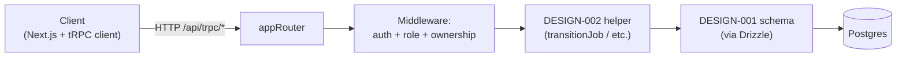

## 1. Purpose

Realises ADR-003 (tRPC for the domain API). Defines every procedure that exposes BCC-01 / BCC-02 / BCC-03 operations to the web client (and, in future, mobile via the same procedures). Each procedure is **the single HTTP-callable wrapper** around either a DESIGN-002 FSM helper (for state-changing commands) or a Drizzle query (for queries). Authorisation lives in tRPC middleware — the FSM helpers (DESIGN-002) trust the auth context they receive (per Q-DSG-04 in DESIGN-002).

> **Realises:** PRD-002 R-01..R-11; PRD-004 R-01..R-12; PRD-005 R-01..R-09; PRD-006 R-01..R-12; PRD-007 R-01..R-10 (read-side); PRD-008 R-01..R-10. Surfaces all 16 BCC-02 CMD-NN + 8 Q-NN, all 6 BCC-01 CMD-NN + 3 Q-NN (where Better Auth doesn't already expose them), and the BCC-03 CMD/Q set per PRD-008.
> **Definition of success:** an implementation agent can read this design + DESIGN-001 + DESIGN-002 and produce all tRPC routers + procedures with no further design questions; every PRD AC reaches a passing test through one or more procedures defined here.

## 2. Scope

### 2.1 In scope

- The router layout (`packages/api/routers/`).
- Auth + role middleware (`packages/api/middleware/`).
- Every procedure for BCC-02 (CMD-01..CMD-14, Q-01..Q-08), BCC-03 (PRD-008 CMD/Q), and the BCC-01 procedures *not* directly handled by Better Auth's own endpoints (e.g., `users.changeRole` lives here; `auth.signIn` is a Better Auth route).
- Input + output schemas via `drizzle-zod`.
- Error-to-tRPC-code mapping for the typed errors from DESIGN-002.
- Context shape (`createTRPCContext`) — what every procedure sees.

### 2.2 Out of scope

| Concern | Owned by | Reason |
|---------|----------|--------|
| Better Auth's own routes (`/api/auth/*` — sign-in, sign-up, password reset, OIDC callback) | DESIGN-004 | Library-managed; not tRPC. |
| Server Actions (per ADR-003: ≤3 web-only forms allowed: signup, login, password reset) | DESIGN-004 | Auth-flow forms only; everything else is tRPC. |
| Webhook endpoints (Resend bounce/complaint webhooks) | DESIGN-005 | Inbound webhooks are Route Handlers, not tRPC. |
| Schema declarations | DESIGN-001 | Reused via drizzle-zod imports. |
| FSM helper internals | DESIGN-002 | Procedures call the helpers; don't reimplement. |
| UI component layout | DESIGN-006 (pending) | Procedures expose data; UI consumes it. |

## 3. Architecture

```
packages/api/
  trpc.ts                     ← createTRPCContext + initTRPC + procedure factories
  middleware/
    auth.ts                   ← isAuthed (any session)
    role.ts                   ← isActive, isAlumni, isModerator, isAdmin, isPrivileged
    job.ts                    ← isJobPoster (Alumni who posted), isEnrolled (Active in this job)
  routers/
    index.ts                  ← appRouter aggregating all sub-routers
    jobs.ts                   ← BCC-02: CMD-01..CMD-14 + Q-01..Q-08
    users.ts                  ← BCC-01 + BCC-03: GetSession, GetUserById, role-change, role-grant
    settings.ts               ← Chapter settings get/set (PRD-007 R-07, R-08)
    invites.ts                ← Invite-token generation + revocation (Admin actions; PRD-001 R-01)
    admin.ts                  ← Admin-view aggregates: GetAggregateCounts, ListDisputedJobs, ListUsers (PRD-007 R-02..R-04 + R-08)
  __tests__/
    integration/
      jobs.test.ts
      users.test.ts
      ...
```



## 4. Detailed design

### 4.1 `packages/api/trpc.ts` — context + procedure factories

Defines `createTRPCContext` (per-request setup) and the typed procedure factories that downstream routers compose.

```ts
import { initTRPC, TRPCError } from '@trpc/server';
import { auth } from '@app/auth';                // Better Auth wrapper from DESIGN-004
import type { Session } from '@app/auth';
import { db } from '@app/db';

export interface TRPCContext {
  db: typeof db;
  session: Session | null;                       // null when unauthenticated
  // Convenience accessors derived from session, for ergonomic procedures.
  userId: string | null;
  userRole: 'Active' | 'Alumni' | 'Moderator' | 'Admin' | null;
}

export const createTRPCContext = async ({ req }: { req: Request }): Promise<TRPCContext> => {
  const session = await auth.getSession({ headers: req.headers });
  return {
    db,
    session,
    userId: session?.user.id ?? null,
    userRole: session?.user.role ?? null,
  };
};

const t = initTRPC.context<TRPCContext>().create({
  // errorFormatter mapping per §7.
});

// Public — no auth required (limited use; mostly health checks).
export const publicProcedure = t.procedure;

// Authed — any logged-in user.
export const authedProcedure = t.procedure.use(async ({ ctx, next }) => {
  if (!ctx.session) throw new TRPCError({ code: 'UNAUTHORIZED' });
  return next({ ctx: { ...ctx, session: ctx.session, userId: ctx.session.user.id, userRole: ctx.session.user.role } });
});

export const router = t.router;
```

### 4.2 `packages/api/middleware/role.ts` — role-gating middleware

Composable role gates. Each builds on `authedProcedure`.

```ts
import { TRPCError } from '@trpc/server';
import { authedProcedure } from '../trpc';
import { isPrivileged } from '@app/domain/roles';

export const activeProcedure    = authedProcedure.use(({ ctx, next }) => {
  if (ctx.userRole !== 'Active') throw new TRPCError({ code: 'FORBIDDEN' });
  return next();
});

export const alumniProcedure    = authedProcedure.use(({ ctx, next }) => {
  if (ctx.userRole !== 'Alumni' && ctx.userRole !== 'Moderator' && ctx.userRole !== 'Admin') {
    // Moderators + Admins are also Alumni in capability; only Active is excluded
    throw new TRPCError({ code: 'FORBIDDEN' });
  }
  return next();
});

export const moderatorProcedure = authedProcedure.use(({ ctx, next }) => {
  if (ctx.userRole !== 'Moderator' && ctx.userRole !== 'Admin') {
    throw new TRPCError({ code: 'FORBIDDEN' });
  }
  return next();
});

export const adminProcedure     = authedProcedure.use(({ ctx, next }) => {
  if (ctx.userRole !== 'Admin') throw new TRPCError({ code: 'FORBIDDEN' });
  return next();
});

export const privilegedProcedure = authedProcedure.use(({ ctx, next }) => {
  if (!ctx.userRole || !isPrivileged(ctx.userRole)) throw new TRPCError({ code: 'FORBIDDEN' });
  return next();
});
```

> **Note on Alumni-vs-Moderator-vs-Admin in `alumniProcedure`:** elevation includes capability. A Moderator who needs to *post* a job uses Alumni capability (PRD-002 Q-03 self-approval allowed). Tightening this to "Alumni-role-exactly" would block Mod-Alumni postings — the wrong behaviour.

### 4.3 `packages/api/middleware/job.ts` — job-ownership middleware

For procedures that require "you must be the posting Alumni" or "you must be enrolled in this job."

```ts
import { TRPCError } from '@trpc/server';
import { eq, and } from 'drizzle-orm';
import { jobs, jobEnrollments } from '@app/db/schema';
import { authedProcedure } from '../trpc';

export const jobPosterProcedure = authedProcedure.use(async ({ ctx, input, next }) => {
  // Convention: the procedure's input must include `jobId: string`.
  const jobId = (input as { jobId: string }).jobId;
  const [job] = await ctx.db.select({ postedBy: jobs.postedBy }).from(jobs).where(eq(jobs.id, jobId));
  if (!job) throw new TRPCError({ code: 'NOT_FOUND' });
  if (job.postedBy !== ctx.userId) throw new TRPCError({ code: 'FORBIDDEN' });
  return next({ ctx: { ...ctx, job } });
});

export const enrolledProcedure = authedProcedure.use(async ({ ctx, input, next }) => {
  const jobId = (input as { jobId: string }).jobId;
  const [row] = await ctx.db
    .select()
    .from(jobEnrollments)
    .where(and(eq(jobEnrollments.jobId, jobId), eq(jobEnrollments.activeId, ctx.userId)));
  if (!row) throw new TRPCError({ code: 'FORBIDDEN' });
  return next();
});
```

### 4.4 `packages/api/routers/jobs.ts` — BCC-02 procedures

The largest router. One mutation per BCC-02 CMD-NN; one query per Q-NN.

```ts
import { z } from 'zod';
import { router } from '../trpc';
import { alumniProcedure, moderatorProcedure, activeProcedure, adminProcedure, privilegedProcedure, authedProcedure } from '../middleware/role';
import { jobPosterProcedure, enrolledProcedure } from '../middleware/job';
import { createJob, approveJob, transitionJob, recordRelationshipEvent } from '@app/domain/job-state-machine';
import { jobs, jobEnrollments, jobStateTransitions, type JobState } from '@app/db/schema';
import { sendTreasurerEmail, sendAdminDisputeEmail, sendModeratorQueueEmail } from '@app/notifications';   // DESIGN-005
import { getSetting } from '@app/settings';                                         // ADR-010 helper
import { and, eq, sql, asc, desc } from 'drizzle-orm';

export const jobsRouter = router({
  // ─── Mutations ─────────────────────────────────────────────────────

  // CMD-01 PostJob — PRD-002 R-01..R-05 + R-12 (moderator-queue notification)
  post: alumniProcedure
    .input(z.object({
      description: z.string().trim().min(1),                    // PRD-002 R-03
      duesAmount: z.number().positive(),                         // PRD-002 R-02
      recommendedPeopleCount: z.number().int().min(1),           // PRD-002 R-04
    }))
    .mutation(async ({ ctx, input }) => {
      const { jobId } = await createJob({
        posterId: ctx.userId,
        description: input.description,
        duesAmount: input.duesAmount,
        recommendedPeopleCount: input.recommendedPeopleCount,
        // PRD-002 R-12 — fire moderator notification once the row commits.
        afterCommit: async (jobId) => { await sendModeratorQueueEmail({ jobId }); },
      });
      return { jobId };
    }),

  // CMD-02 ApproveJob — PRD-002 R-07
  approve: moderatorProcedure
    .input(z.object({ jobId: z.string().uuid() }))
    .mutation(async ({ ctx, input }) => {
      await approveJob({ jobId: input.jobId, moderatorId: ctx.userId });
    }),

  // CMD-03 RejectJob — PRD-002 R-08
  reject: moderatorProcedure
    .input(z.object({ jobId: z.string().uuid(), reason: z.string().trim().min(1) }))
    .mutation(async ({ ctx, input }) => {
      await transitionJob({
        jobId: input.jobId,
        expectedFromState: 'awaiting_moderation',
        event: 'reject',
        actor: { id: ctx.userId, kind: 'user' },
        note: input.reason,
        beforeStateWrite: async (tx) => {
          await tx.update(jobs).set({ rejectionReason: input.reason }).where(eq(jobs.id, input.jobId));
        },
      });
    }),

  // CMD-04 EnrollInJob — PRD-004 R-02
  // Persistence + audit-log row land via `recordRelationshipEvent()` (DESIGN-002 §4.1.5)
  // so DESIGN-002 stays the sole writer of job_state_transitions rows.
  enroll: activeProcedure
    .input(z.object({ jobId: z.string().uuid() }))
    .mutation(async ({ ctx, input }) => {
      // Guard: job must be in enrollment_open.
      const [job] = await ctx.db.select({ state: jobs.state }).from(jobs).where(eq(jobs.id, input.jobId));
      if (!job) throw new TRPCError({ code: 'NOT_FOUND' });
      if (job.state !== 'enrollment_open') throw new TRPCError({ code: 'BAD_REQUEST', message: 'Job is not accepting enrollments.' });

      // Pre-check idempotency: skip the audit-log write when the row already exists.
      const existing = await ctx.db
        .select({ jobId: jobEnrollments.jobId })
        .from(jobEnrollments)
        .where(and(eq(jobEnrollments.jobId, input.jobId), eq(jobEnrollments.activeId, ctx.userId)));
      if (existing.length > 0) return;   // ADC-01 INV-14 — no-op on re-enroll.

      await recordRelationshipEvent({
        jobId: input.jobId,
        currentState: 'enrollment_open',
        event: 'enroll',
        actor: { id: ctx.userId, kind: 'user' },
        beforeAuditWrite: async (tx) => {
          await tx.insert(jobEnrollments)
            .values({ jobId: input.jobId, activeId: ctx.userId })
            .onConflictDoNothing();
        },
      });
    }),

  // CMD-05 UnenrollFromJob — PRD-004 R-03 / R-04
  unenroll: activeProcedure
    .input(z.object({ jobId: z.string().uuid() }))
    .mutation(async ({ ctx, input }) => {
      const [job] = await ctx.db.select({ state: jobs.state }).from(jobs).where(eq(jobs.id, input.jobId));
      if (!job) throw new TRPCError({ code: 'NOT_FOUND' });
      if (job.state !== 'enrollment_open') throw new TRPCError({ code: 'BAD_REQUEST', message: 'Cannot unenroll once the job is locked.' });

      // Pre-check: only write the audit-log row when an enrollment actually existed.
      const existing = await ctx.db
        .select({ jobId: jobEnrollments.jobId })
        .from(jobEnrollments)
        .where(and(eq(jobEnrollments.jobId, input.jobId), eq(jobEnrollments.activeId, ctx.userId)));
      if (existing.length === 0) return;

      await recordRelationshipEvent({
        jobId: input.jobId,
        currentState: 'enrollment_open',
        event: 'unenroll',
        actor: { id: ctx.userId, kind: 'user' },
        beforeAuditWrite: async (tx) => {
          await tx.delete(jobEnrollments)
            .where(and(eq(jobEnrollments.jobId, input.jobId), eq(jobEnrollments.activeId, ctx.userId)));
        },
      });
    }),

  // CMD-06 LockJob — PRD-004 R-07/R-08/R-09
  lock: jobPosterProcedure
    .input(z.object({ jobId: z.string().uuid(), workDate: z.string().datetime() }))
    .mutation(async ({ ctx, input }) => {
      const workDate = new Date(input.workDate);
      if (workDate <= new Date()) throw new TRPCError({ code: 'BAD_REQUEST', message: 'Work date must be in the future.' });
      // R-09 enrollee count ≥ 1
      const [{ count }] = await ctx.db
        .select({ count: sql<number>`count(*)::int` })
        .from(jobEnrollments)
        .where(eq(jobEnrollments.jobId, input.jobId));
      if (count === 0) throw new TRPCError({ code: 'BAD_REQUEST', message: 'At least one Active must be enrolled to lock.' });

      await transitionJob({
        jobId: input.jobId,
        expectedFromState: 'enrollment_open',
        event: 'lock',
        actor: { id: ctx.userId, kind: 'user' },
        note: workDate.toISOString(),
        beforeStateWrite: async (tx) => {
          await tx.update(jobs).set({ workDate }).where(eq(jobs.id, input.jobId));
        },
      });
    }),

  // CMD-07 RescheduleJob — PRD-004 R-10
  reschedule: jobPosterProcedure
    .input(z.object({ jobId: z.string().uuid() }))
    .mutation(async ({ ctx, input }) => {
      // Capture prior workDate for the audit-log note (Q-CTX-... in PRD-004)
      const [job] = await ctx.db.select({ workDate: jobs.workDate }).from(jobs).where(eq(jobs.id, input.jobId));
      await transitionJob({
        jobId: input.jobId,
        expectedFromState: 'locked',
        event: 'reschedule',
        actor: { id: ctx.userId, kind: 'user' },
        note: job?.workDate?.toISOString() ?? null,
        beforeStateWrite: async (tx) => {
          await tx.update(jobs).set({ workDate: null }).where(eq(jobs.id, input.jobId));
        },
      });
    }),

  // CMD-08 CancelJob — PRD-004 R-11
  cancel: jobPosterProcedure
    .input(z.object({ jobId: z.string().uuid(), reason: z.string().trim().min(1) }))
    .mutation(async ({ ctx, input }) => {
      // Allowed from enrollment_open OR locked. Read state to pick expectedFromState.
      const [job] = await ctx.db.select({ state: jobs.state }).from(jobs).where(eq(jobs.id, input.jobId));
      if (!job) throw new TRPCError({ code: 'NOT_FOUND' });
      if (job.state !== 'enrollment_open' && job.state !== 'locked') throw new TRPCError({ code: 'BAD_REQUEST', message: 'Job is not cancellable in its current state.' });
      await transitionJob({
        jobId: input.jobId,
        expectedFromState: job.state,
        event: 'cancel',
        actor: { id: ctx.userId, kind: 'user' },
        note: input.reason,
        beforeStateWrite: async (tx) => {
          await tx.update(jobs).set({ cancellationReason: input.reason }).where(eq(jobs.id, input.jobId));
        },
      });
    }),

  // CMD-09 CompleteJob — PRD-005 R-01..R-04
  complete: jobPosterProcedure
    .input(z.object({ jobId: z.string().uuid(), confirmedAttendees: z.array(z.string().uuid()).min(1) }))
    .mutation(async ({ ctx, input }) => {
      // R-03: every confirmed attendee must be enrolled
      const enrolled = await ctx.db.select({ activeId: jobEnrollments.activeId }).from(jobEnrollments).where(eq(jobEnrollments.jobId, input.jobId));
      const enrolledSet = new Set(enrolled.map((e) => e.activeId));
      const invalid = input.confirmedAttendees.filter((a) => !enrolledSet.has(a));
      if (invalid.length > 0) throw new TRPCError({ code: 'BAD_REQUEST', message: `Confirmed attendees not enrolled: ${invalid.join(', ')}` });

      // R-04: compute per-Active dues credit (cents-rounded with surplus on alphabetically-first)
      const [job] = await ctx.db.select({ duesAmount: jobs.duesAmount }).from(jobs).where(eq(jobs.id, input.jobId));
      const credit = computeDuesSplit(parseFloat(job!.duesAmount), input.confirmedAttendees, ctx);   // helper detailed in §4.4.1

      await transitionJob({
        jobId: input.jobId,
        expectedFromState: 'locked',
        event: 'complete',
        actor: { id: ctx.userId, kind: 'user' },
        note: `${input.confirmedAttendees.length} attendees confirmed`,
        beforeStateWrite: async (tx) => {
          // Mark confirmedAttendee on each enrollment row
          for (const activeId of input.confirmedAttendees) {
            await tx.update(jobEnrollments).set({ confirmedAttendee: sql`now()` })
              .where(and(eq(jobEnrollments.jobId, input.jobId), eq(jobEnrollments.activeId, activeId)));
          }
        },
        afterStateWrite: async (tx) => {
          await tx.update(jobs).set({ perActiveDuesCredit: credit }).where(eq(jobs.id, input.jobId));
        },
      });
    }),

  // CMD-10 RevertCompletion — PRD-005 R-05
  revertCompletion: jobPosterProcedure
    .input(z.object({ jobId: z.string().uuid() }))
    .mutation(async ({ ctx, input }) => {
      await transitionJob({
        jobId: input.jobId,
        expectedFromState: 'completed',
        event: 'revert',
        actor: { id: ctx.userId, kind: 'user' },
        beforeStateWrite: async (tx) => {
          await tx.update(jobEnrollments).set({ confirmedAttendee: null }).where(eq(jobEnrollments.jobId, input.jobId));
          await tx.update(jobs).set({ perActiveDuesCredit: null }).where(eq(jobs.id, input.jobId));
        },
      });
    }),

  // CMD-11 MarkPaymentSent — PRD-005 R-06/R-07
  markPaymentSent: jobPosterProcedure
    .input(z.object({ jobId: z.string().uuid() }))
    .mutation(async ({ ctx, input }) => {
      await transitionJob({
        jobId: input.jobId,
        expectedFromState: 'completed',
        event: 'payment_sent',
        actor: { id: ctx.userId, kind: 'user' },
        afterCommit: async () => {
          const treasurerEmail = await getSetting('treasurer_recipient_email');
          await sendTreasurerEmail({ jobId: input.jobId, recipient: treasurerEmail });
        },
      });
    }),

  // CMD-12 ConfirmReceipt — PRD-006 R-01..R-04
  confirmReceipt: authedProcedure
    .input(z.object({ jobId: z.string().uuid() }))
    .use(async ({ ctx, input, next }) => {
      // Authorize: enrolled Active OR Admin
      if (ctx.userRole === 'Admin') return next();
      if (ctx.userRole === 'Active') {
        const [row] = await ctx.db.select().from(jobEnrollments).where(and(eq(jobEnrollments.jobId, input.jobId), eq(jobEnrollments.activeId, ctx.userId)));
        if (row) return next();
      }
      throw new TRPCError({ code: 'FORBIDDEN' });
    })
    .mutation(async ({ ctx, input }) => {
      try {
        await transitionJob({
          jobId: input.jobId,
          expectedFromState: 'payment_sent',
          event: 'confirm_receipt',
          actor: { id: ctx.userId, kind: 'user' },
        });
        return { state: 'closed', closedBy: ctx.userId };
      } catch (err) {
        // R-04 idempotency: if it's already closed, return non-error response with closedBy info
        if (err.code === 'CONCURRENT_TRANSITION') {
          const [closingRow] = await ctx.db.select().from(jobStateTransitions)
            .where(and(eq(jobStateTransitions.jobId, input.jobId), eq(jobStateTransitions.toState, 'closed')))
            .orderBy(desc(jobStateTransitions.createdAt)).limit(1);
          return { state: 'closed', closedBy: closingRow?.actorId ?? null, alreadyClosed: true };
        }
        throw err;
      }
    }),

  // CMD-13 DisputeJob — PRD-006 R-05/R-06/R-07
  dispute: authedProcedure
    .input(z.object({ jobId: z.string().uuid(), reason: z.string().trim().min(1) }))
    .use(async ({ ctx, input, next }) => {
      // Same auth pattern as confirmReceipt
      if (ctx.userRole === 'Admin') return next();
      if (ctx.userRole === 'Active') {
        const [row] = await ctx.db.select().from(jobEnrollments).where(and(eq(jobEnrollments.jobId, input.jobId), eq(jobEnrollments.activeId, ctx.userId)));
        if (row) return next();
      }
      throw new TRPCError({ code: 'FORBIDDEN' });
    })
    .mutation(async ({ ctx, input }) => {
      await transitionJob({
        jobId: input.jobId,
        expectedFromState: 'payment_sent',
        event: 'dispute',
        actor: { id: ctx.userId, kind: 'user' },
        note: input.reason,
        beforeStateWrite: async (tx) => {
          await tx.update(jobs).set({ disputeReason: input.reason }).where(eq(jobs.id, input.jobId));
        },
        afterCommit: async () => {
          const adminEmail = await getSetting('admin_recipient_email');
          await sendAdminDisputeEmail({ jobId: input.jobId, disputerId: ctx.userId, reason: input.reason, recipient: adminEmail });
        },
      });
    }),

  // CMD-14a/b/c ResolveDispute* — PRD-006 R-08/R-09/R-10
  resolveDisputeAsClosed: adminProcedure
    .input(z.object({ jobId: z.string().uuid(), note: z.string().trim().min(1) }))
    .mutation(async ({ ctx, input }) => {
      await transitionJob({
        jobId: input.jobId,
        expectedFromState: 'disputed',
        event: 'resolve_closed',
        actor: { id: ctx.userId, kind: 'user' },
        note: input.note,
        beforeStateWrite: async (tx) => {
          await tx.update(jobs).set({ disputeReason: null }).where(eq(jobs.id, input.jobId));
        },
      });
    }),
  resolveDisputeAsCancelled: adminProcedure
    .input(z.object({ jobId: z.string().uuid(), note: z.string().trim().min(1) }))
    .mutation(/* analogous to resolveDisputeAsClosed with event 'resolve_cancelled' */),
  resolveDisputeAsPaymentSent: adminProcedure
    .input(z.object({ jobId: z.string().uuid(), note: z.string().trim().min(1) }))
    .mutation(/* analogous with event 'resolve_payment_sent' */),

  // ─── Queries ───────────────────────────────────────────────────────

  // Q-01 ListJobsByState — role-filtered
  listByState: authedProcedure
    .input(z.object({ state: z.enum(JOB_STATES), limit: z.number().int().min(1).max(100).default(50), offset: z.number().int().min(0).default(0) }))
    .query(async ({ ctx, input }) => {
      // Active: only enrollment_open (jobs they could enroll in)
      // Alumni: their own + enrollment_open
      // Moderator: + awaiting_moderation
      // Admin: all states
      // Detailed filter logic implementation TBD; sketch.
    }),

  // Q-02 GetJobById
  getById: authedProcedure
    .input(z.object({ jobId: z.string().uuid() }))
    .query(async ({ ctx, input }) => {
      // Returns Job with role-aware field projection per PRD-004 R-05 (non-enrolled Active sees count not roster)
    }),

  // Q-03 GetJobHistory — PRD-007 R-06
  getHistory: adminProcedure
    .input(z.object({ jobId: z.string().uuid() }))
    .query(async ({ ctx, input }) => {
      return ctx.db.select().from(jobStateTransitions)
        .where(eq(jobStateTransitions.jobId, input.jobId))
        .orderBy(asc(jobStateTransitions.createdAt));
    }),

  // Q-04 ListMyPostedJobs — PRD-002 R-11
  listMyPosted: alumniProcedure
    .query(async ({ ctx }) => {
      return ctx.db.select().from(jobs).where(eq(jobs.postedBy, ctx.userId)).orderBy(desc(jobs.createdAt));
    }),

  // Q-05 ListMyEnrolledJobs — PRD-004 R-06
  listMyEnrolled: activeProcedure
    .query(async ({ ctx }) => {
      // Join jobs + jobEnrollments where activeId = ctx.userId
    }),

  // Q-08 ListModerationQueue — PRD-002 R-06
  listModerationQueue: moderatorProcedure
    .query(async ({ ctx }) => {
      return ctx.db.select().from(jobs).where(eq(jobs.state, 'awaiting_moderation')).orderBy(asc(jobs.createdAt));
    }),
});
```

#### 4.4.1 `computeDuesSplit()` helper

Lives in `packages/domain/dues.ts` (not a separate design doc — small enough). Implements ADC-01 INV-05 (rounding cents on alphabetically-first attendee).

```ts
export function computeDuesSplit(total: number, attendeeIds: string[], ctx: TRPCContext): Record<string, string> {
  // Fetch display names for sorting
  // Compute cents per attendee = Math.floor((total * 100) / N)
  // Surplus = (total * 100) - (centsPer * N)
  // Sort attendees by display name
  // First [surplus] attendees get an extra cent
  // Return Record<userId, "X.XX"> (string for jsonb persistence)
}
```

### 4.5 `packages/api/routers/users.ts` — BCC-01 + BCC-03 procedures

```ts
export const usersRouter = router({
  // PRD-008 self-service role change
  changeRole: authedProcedure
    .input(z.object({ toRole: z.enum(['Active', 'Alumni']) }))    // R-04: only non-privileged via self-service
    .mutation(async ({ ctx, input }) => {
      await transitionRole({
        targetUserId: ctx.userId,
        expectedFromRole: ctx.userRole,
        toRole: input.toRole,
        initiator: { id: ctx.userId, kind: 'user' },
      });
    }),

  // PRD-008 step-down (Mod/Admin → non-privileged) — same procedure as changeRole; role-helper already prevents self-elevation

  // PRD-008 Admin grant
  grantRole: adminProcedure
    .input(z.object({ targetUserId: z.string().uuid(), toRole: z.enum(['Active', 'Alumni', 'Moderator', 'Admin']) }))
    .mutation(async ({ ctx, input }) => {
      // Read target's current role
      const [target] = await ctx.db.select({ role: users.role }).from(users).where(eq(users.id, input.targetUserId));
      if (!target) throw new TRPCError({ code: 'NOT_FOUND' });
      await transitionRole({
        targetUserId: input.targetUserId,
        expectedFromRole: target.role,
        toRole: input.toRole,
        initiator: { id: ctx.userId, kind: 'admin' },
      });
    }),

  // PRD-007 R-08 list users — Admin only
  list: adminProcedure
    .query(async ({ ctx }) => {
      return ctx.db.select({ id: users.id, displayName: users.displayName, email: users.email, role: users.role }).from(users).orderBy(asc(users.displayName));
    }),

  // PRD-008 R-10 user role-change history
  getRoleHistory: adminProcedure
    .input(z.object({ userId: z.string().uuid() }))
    .query(async ({ ctx, input }) => {
      return ctx.db.select().from(userRoleTransitions).where(eq(userRoleTransitions.userId, input.userId)).orderBy(desc(userRoleTransitions.createdAt));
    }),

  // BCC-01 GetSession — exposed for client-side session reads
  getSession: publicProcedure.query(({ ctx }) => ctx.session),

  // BCC-01 GetUserById (for roster + audit-log display)
  getById: authedProcedure
    .input(z.object({ userId: z.string().uuid() }))
    .query(/* select id, displayName, role from users */),
});
```

### 4.6 `packages/api/routers/settings.ts` — chapter settings (PRD-007 R-07/R-08)

```ts
export const settingsRouter = router({
  list: adminProcedure
    .query(async ({ ctx }) => {
      return ctx.db.select().from(chapterSettings);
    }),

  set: adminProcedure
    .input(z.object({
      key: z.enum(['admin_recipient_email', 'treasurer_recipient_email', 'moderators_recipient_email', 'chapter_timezone', 'chapter_display_name']),
      value: z.unknown(),
    }))
    .mutation(async ({ ctx, input }) => {
      // Per-key Zod validation:
      const validated = SETTING_VALIDATORS[input.key].parse(input.value);
      await ctx.db.insert(chapterSettings)
        .values({ key: input.key, value: validated, updatedBy: ctx.userId })
        .onConflictDoUpdate({ target: chapterSettings.key, set: { value: validated, updatedBy: ctx.userId, updatedAt: sql`now()` } });
    }),
});

const SETTING_VALIDATORS = {
  admin_recipient_email: z.string().email(),
  treasurer_recipient_email: z.string().email(),
  moderators_recipient_email: z.string().email(),
  chapter_timezone: z.string().regex(/^[A-Za-z_]+\/[A-Za-z_]+$/),                // IANA tz format
  chapter_display_name: z.string().trim().min(1).max(120),
};
```

### 4.7 `packages/api/routers/admin.ts` — Admin-view aggregates (PRD-007 R-02/R-04)

```ts
export const adminRouter = router({
  // R-02 aggregate counts (live SQL)
  getAggregateCounts: adminProcedure
    .query(async ({ ctx }) => {
      const result = await ctx.db.execute(sql`
        SELECT state, COUNT(*)::int AS count
        FROM jobs
        GROUP BY state
      `);
      // Reshape to { state: count } map
      return result.rows.reduce((acc, row) => ({ ...acc, [row.state]: row.count }), {} as Record<JobState, number>);
    }),

  // R-04 disputes drill-in
  listDisputed: adminProcedure
    .query(async ({ ctx }) => {
      return ctx.db.select(/* job + disputer info + age */).from(jobs).where(eq(jobs.state, 'disputed'));
    }),
});
```

### 4.8 `packages/api/routers/invites.ts` — invite-token management (Admin)

```ts
export const invitesRouter = router({
  generate: adminProcedure
    .input(z.object({ preselectedRole: z.enum(['Active', 'Alumni']) }))
    .mutation(async ({ ctx, input }) => {
      const token = crypto.randomUUID().replace(/-/g, '');
      const [row] = await ctx.db.insert(inviteTokens).values({
        token, preselectedRole: input.preselectedRole, createdBy: ctx.userId,
      }).returning({ id: inviteTokens.id, token: inviteTokens.token });
      return { url: `${process.env.PUBLIC_BASE_URL}/signup?token=${row.token}` };
    }),

  list: adminProcedure
    .query(async ({ ctx }) => {
      return ctx.db.select().from(inviteTokens).orderBy(desc(inviteTokens.createdAt));
    }),

  revoke: adminProcedure
    .input(z.object({ tokenId: z.string().uuid() }))
    .mutation(async ({ ctx, input }) => {
      await ctx.db.update(inviteTokens).set({ revokedAt: sql`now()` }).where(eq(inviteTokens.id, input.tokenId));
    }),
});
```

### 4.9 `packages/api/routers/index.ts` — root router

```ts
import { router } from '../trpc';
import { jobsRouter } from './jobs';
import { usersRouter } from './users';
import { settingsRouter } from './settings';
import { adminRouter } from './admin';
import { invitesRouter } from './invites';

export const appRouter = router({
  jobs: jobsRouter,
  users: usersRouter,
  settings: settingsRouter,
  admin: adminRouter,
  invites: invitesRouter,
});

export type AppRouter = typeof appRouter;
```

## 5. Migration / data shape

N/A — schema is owned by DESIGN-001. This design composes Drizzle queries against that schema.

## 6. API contracts

The exhaustive list of procedures lives in §4 by router. Cross-reference:

| Procedure | Implements | tRPC type |
|-----------|------------|-----------|
| `jobs.post` | PRD-002 CMD-01 | mutation |
| `jobs.approve` | PRD-002 CMD-02 | mutation |
| `jobs.reject` | PRD-002 CMD-03 | mutation |
| `jobs.enroll` | PRD-004 CMD-04 | mutation |
| `jobs.unenroll` | PRD-004 CMD-05 | mutation |
| `jobs.lock` | PRD-004 CMD-06 | mutation |
| `jobs.reschedule` | PRD-004 CMD-07 | mutation |
| `jobs.cancel` | PRD-004 CMD-08 | mutation |
| `jobs.complete` | PRD-005 CMD-09 | mutation |
| `jobs.revertCompletion` | PRD-005 CMD-10 | mutation |
| `jobs.markPaymentSent` | PRD-005 CMD-11 | mutation |
| `jobs.confirmReceipt` | PRD-006 CMD-12 | mutation |
| `jobs.dispute` | PRD-006 CMD-13 | mutation |
| `jobs.resolveDisputeAs{Closed,Cancelled,PaymentSent}` | PRD-006 CMD-14a/b/c | mutation |
| `jobs.listByState` | BCC-02 Q-01 | query |
| `jobs.getById` | BCC-02 Q-02 | query |
| `jobs.getHistory` | BCC-02 Q-03 / PRD-007 R-06 | query |
| `jobs.listMyPosted` | BCC-02 Q-04 / PRD-002 R-11 | query |
| `jobs.listMyEnrolled` | BCC-02 Q-05 / PRD-004 R-06 | query |
| `jobs.listModerationQueue` | BCC-02 Q-08 / PRD-002 R-06 | query |
| `users.changeRole` | PRD-008 R-01 | mutation |
| `users.grantRole` | PRD-008 R-02/R-03 | mutation |
| `users.list` | PRD-007 R-08 / PRD-008 R-08 | query |
| `users.getRoleHistory` | PRD-008 R-10 | query |
| `users.getSession` | BCC-01 Q-01 | query |
| `users.getById` | BCC-01 Q-02 | query |
| `settings.list` / `settings.set` | PRD-007 R-07/R-08 | query / mutation |
| `admin.getAggregateCounts` | PRD-007 R-02 | query |
| `admin.listDisputed` | PRD-007 R-04 | query |
| `invites.generate` / `invites.list` / `invites.revoke` | PRD-001 R-01 + PRD-008 ancillary | mutation / query |

## 7. Error handling

| Source | tRPC code | Mapped from |
|--------|-----------|-------------|
| Missing session | `UNAUTHORIZED` | `authedProcedure` middleware |
| Wrong role | `FORBIDDEN` | role-gating middleware |
| Not the posting Alumni | `FORBIDDEN` | `jobPosterProcedure` |
| Not enrolled | `FORBIDDEN` | `enrolledProcedure` |
| Job not found | `NOT_FOUND` | per-procedure |
| Validation error (Zod) | `BAD_REQUEST` | tRPC default |
| `FsmViolationError` (DESIGN-002) | `INTERNAL_SERVER_ERROR` | bug — TS should prevent |
| `ConcurrentTransitionError` (DESIGN-002) | `CONFLICT` | special-cased: `confirmReceipt` swallows + returns idempotent response (PRD-006 R-04 / AC-04) |
| `MinAdminInvariantError` (DESIGN-002) | `UNPROCESSABLE_CONTENT` (422) with `code: 'MIN_ADMIN_INVARIANT_VIOLATED'` | PRD-008 R-05 |
| Postgres CHECK violation (other) | `INTERNAL_SERVER_ERROR` | bug — Zod should catch first |

A custom `errorFormatter` in `packages/api/trpc.ts` extracts `code` and `message` from typed errors and surfaces them in a way the UI can branch on (e.g., the min-Admin error needs UI-side handling per PRD-008 R-06).

## 8. Testing approach

Per project test-DB rule: all integration tests against PG16 via testcontainers — no SQLite or MySQL substitution.

- **Per-router integration tests** in `packages/api/__tests__/integration/<router>.test.ts`:
  - One test per procedure × happy path
  - One test per procedure × auth/role rejection (UNAUTHORIZED / FORBIDDEN)
  - Specific PRD-AC mappings for the procedures called out in §6

- **End-to-end happy path** in `packages/api/__tests__/e2e/walking-skeleton.test.ts`: calls the procedures in order — `invites.generate` → mock signup → `jobs.post` → `jobs.approve` → `jobs.enroll` → `jobs.lock` → `jobs.complete` → `jobs.markPaymentSent` → `jobs.confirmReceipt` → assert `closed`. Asserts the audit log has all expected rows in order.

Coverage target: every PRD AC across all 6 capability PRDs maps to at least one passing test through one or more procedures here.

## 9. Open questions

| ID | Question | Owner | Needed by |
|----|----------|-------|-----------|
| Q-DSG-01 | Should `jobs.enroll` be idempotent at the *API* level (return 200 on re-enroll) or strict (409 on re-enroll)? Lean: **idempotent** (per ADC-01 INV-14 + the §4.4 sketch using `ON CONFLICT DO NOTHING`). Matches user expectation that "click twice doesn't error." | Design | Pre-implementation |
| Q-DSG-02 | tRPC + React Query: should we use a server-action wrapper for the few forms that don't need real-time validation (signup, etc.)? Per ADR-003 yes, ≤3 forms. Specifically: signup form, login form, password-reset form. All other forms call tRPC. | Design | Pre-implementation |
| Q-DSG-03 | Field-level Zod schemas duplicated between schemas (DESIGN-001 drizzle-zod) and procedure inputs here. Should we standardise on importing `userInsertSchema.pick({ ... })` style everywhere, or accept some duplication for clarity? Lean: **import-and-pick** for write paths, write fresh schemas for read filters / pagination params. | Design | Pre-implementation |
| Q-DSG-04 | The `jobs.confirmReceipt` race-handling (returning idempotent `{ alreadyClosed: true }` rather than 409) is non-standard tRPC behaviour. Document it in OpenAPI/JSDoc on the procedure so client devs see the contract. | Design | Pre-implementation |

## 10. Changelog

| Date | Author | Change |
|------|--------|--------|
| 2026-05-14 | Tom Haynes | Initial draft. Covers all MVP procedures across 5 routers (jobs, users, settings, admin, invites). Maps each procedure to a PRD CMD-NN / Q-NN. Auth + role + ownership middleware composable per the alumni/moderator/admin/jobPoster pattern. confirmReceipt special-cases concurrent-receipt race per PRD-006 R-04. Treasurer + admin emails fired via `afterCommit` hook (DESIGN-005 helpers). 4 design follow-up questions. |
| 2026-05-14 | Tom Haynes | §4.4 `enroll` / `unenroll` no longer `INSERT INTO jobStateTransitions` directly — both call `recordRelationshipEvent()` (DESIGN-002 §4.1.5) so the helper module stays the sole writer of audit-log rows. Persistence + audit-log row are atomic via the helper's `beforeAuditWrite` callback. `jobs.post` now passes `afterCommit: sendModeratorQueueEmail` to `createJob()` per PRD-002 R-12. Imports updated. |
