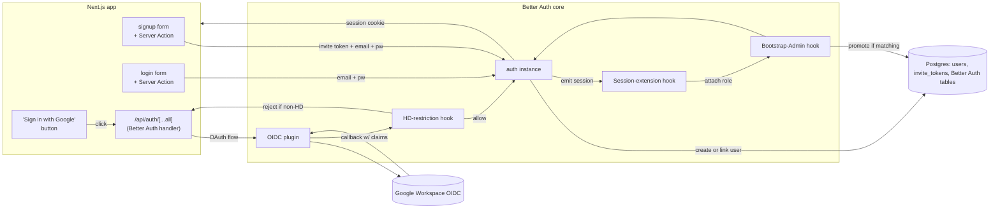

## 1. Purpose

Realises BCC-01 Identity & Access end-to-end: Better Auth instance configuration, Workspace OIDC plugin wiring with HD restriction at the OAuth callback, invite-token-gated app-managed signup, account-linking on first SSO sign-in for an existing app-managed account, and `BOOTSTRAP_ADMIN_EMAIL` boot-time promotion. Defines the three Server-Action forms permitted by ADR-003 (signup, login, password reset).

> **Realises:** PRD-003 R-01..R-09; PRD-001 R-01 (invite-link signup); PRD-008 R-01 (default role at signup); ADC-02 §6 commands; ADR-002 (Better Auth) end-to-end wiring; ADR-007 (Workspace OIDC) end-to-end wiring; ADR-011 §Decision-outcome (role column populated by this design).
> **Definition of success:** an implementation agent can read this design + DESIGN-001 + DESIGN-003 and produce a working auth subsystem where (a) an Active invite link → app-managed signup creates a User with `role='Active'`, (b) Workspace SSO from `@<HD>` creates or links an Alumni User with `role='Alumni'` (or its existing role if linking), (c) HD-non-matching SSO requests are rejected before any session is created, (d) `BOOTSTRAP_ADMIN_EMAIL` env var promotes the named user on next login.

## 2. Scope

### 2.1 In scope

- The Better Auth `auth` instance configuration and its OIDC plugin setup.
- The HD-restriction hook at the OAuth callback (per ADR-007).
- Invite-token verification middleware + the signup Server Action.
- The login + password-reset Server Actions.
- The account-linking flow on first SSO sign-in for an existing email.
- The `BOOTSTRAP_ADMIN_EMAIL` boot-time promotion.
- The session-extension hook so `session.user.role` is present (consumed by DESIGN-003 middleware).

### 2.2 Out of scope

| Concern | Owned by | Reason |
|---------|----------|--------|
| Database tables (users, invite_tokens, Better Auth's own) | DESIGN-001 | Schema-at-rest. |
| Post-signup role transitions | DESIGN-002 (`transitionRole`) | This design sets initial role only. |
| tRPC procedures (e.g., `users.changeRole`, `users.list`) | DESIGN-003 | API surface. |
| UI components (signup form, login form, "Sign in with Google" button) | DESIGN-006 (pending) | Forms call into the Server Actions defined here. |
| Admin's invite-token generation UI | DESIGN-006 + DESIGN-003 (`invites` router) | Admin actions. |

## 3. Architecture

```
packages/auth/
  index.ts                         ← exports auth + getServerSession
  config.ts                        ← Better Auth instance with plugins
  hooks/
    hd-restriction.ts              ← OAuth-callback hook for HD enforcement (ADR-007)
    session-extension.ts           ← adds role to session payload
    bootstrap-admin.ts             ← BOOTSTRAP_ADMIN_EMAIL on-login hook
  invite-tokens/
    verify.ts                      ← validates token + returns preselectedRole
apps/web/
  app/
    api/auth/[...all]/route.ts     ← Better Auth's catch-all route handler
    signup/
      page.tsx                     ← signup form UI (DESIGN-006)
      actions.ts                   ← Server Action: signupWithInviteToken
    login/
      page.tsx                     ← login form UI (DESIGN-006)
      actions.ts                   ← Server Action: signIn
    forgot-password/
      page.tsx
      actions.ts                   ← Server Action: requestPasswordReset
```



## 4. Detailed design

### 4.1 `packages/auth/config.ts`

```ts
import { betterAuth } from 'better-auth';
import { drizzleAdapter } from 'better-auth/adapters/drizzle';
import { genericOAuth } from 'better-auth/plugins/generic-oauth';
import { db } from '@app/db';
import { users } from '@app/db/schema';
import { hdRestrictionHook } from './hooks/hd-restriction';
import { sessionExtensionHook } from './hooks/session-extension';
import { bootstrapAdminHook } from './hooks/bootstrap-admin';

export const auth = betterAuth({
  database: drizzleAdapter(db, { provider: 'pg' }),

  // App-managed signup is gated by invite token at the application layer
  // (Better Auth doesn't natively know about invite tokens; we wrap signUp).
  emailAndPassword: { enabled: true, autoSignIn: true },

  // OIDC SSO via Better Auth's generic OAuth plugin with HD restriction layered on.
  plugins: [
    genericOAuth({
      config: [
        {
          providerId: 'google-workspace',
          clientId: process.env.OIDC_CLIENT_ID!,
          clientSecret: process.env.OIDC_CLIENT_SECRET!,
          discoveryUrl: 'https://accounts.google.com/.well-known/openid-configuration',
          scopes: ['openid', 'email', 'profile'],
          // Pass `hd` as an extra OAuth param for Workspace-domain hint.
          authorizationUrlParams: { hd: process.env.OIDC_HOSTED_DOMAIN! },
          // The HD hook below validates the *response* — the URL param is a hint, not a guarantee.
          mapProfileToUser: (profile) => ({
            email: profile.email,
            displayName: profile.name,
            // role is NOT set here — set by sessionExtensionHook on first sign-in
          }),
        },
      ],
    }),
  ],

  // Hooks run in order: hdRestriction first (rejects non-HD users), then sessionExtension
  // (computes role-extended session shape), then bootstrapAdmin (promotes if matching env var).
  hooks: {
    after: {
      signIn: [bootstrapAdminHook, sessionExtensionHook],
      signUp: [sessionExtensionHook],
      // OIDC-specific: HD enforcement at the callback before session is created
      oauthCallback: [hdRestrictionHook],
    },
  },

  session: {
    cookieName: 't4d_session',
    expiresIn: 60 * 60 * 24 * 7,                   // 7 days
    updateAge: 60 * 60 * 24,                       // refresh idle sessions every day
  },
});

export type Session = Awaited<ReturnType<typeof auth.getSession>>;

export async function getServerSession(headers: Headers) {
  return auth.getSession({ headers });
}
```

### 4.2 `packages/auth/hooks/hd-restriction.ts` — HD enforcement (ADR-007)

```ts
import { TRPCError } from '@trpc/server';

export const hdRestrictionHook = async ({ profile, providerId }: { profile: { email: string; hd?: string }; providerId: string }) => {
  if (providerId !== 'google-workspace') return;        // only enforce for our SSO provider
  const expected = process.env.OIDC_HOSTED_DOMAIN;
  if (!expected) {
    throw new Error('OIDC_HOSTED_DOMAIN is required when google-workspace OIDC is configured');
  }
  // Two checks: the `hd` claim AND the email domain. Either must match expected.
  // (Workspace's `hd` claim is the canonical signal; email-domain check is a belt-and-suspenders.)
  const hdMatches = profile.hd === expected;
  const emailMatches = profile.email.toLowerCase().endsWith(`@${expected.toLowerCase()}`);
  if (!hdMatches || !emailMatches) {
    throw new HdRestrictionError(`Email ${profile.email} is not in the configured hosted domain '${expected}'`);
  }
};

export class HdRestrictionError extends Error {
  readonly code = 'HD_RESTRICTION_FAILED' as const;
}
```

The OAuth callback route catches `HdRestrictionError` and returns a 4xx with a user-facing "Your Google account isn't part of this chapter's domain" message — NOT a 5xx (PRD-003 BR-04 / BCC-01 verification metric).

### 4.3 `packages/auth/hooks/session-extension.ts` — role on session

Better Auth's default session shape doesn't include the `role` column we added to `users`. We extend it via a `mapSession` hook so DESIGN-003's middleware can read `session.user.role` directly.

```ts
import { eq } from 'drizzle-orm';
import { db } from '@app/db';
import { users } from '@app/db/schema';

export const sessionExtensionHook = async ({ user }: { user: { id: string } }) => {
  const [row] = await db.select({ role: users.role, displayName: users.displayName }).from(users).where(eq(users.id, user.id));
  if (!row) throw new Error(`User ${user.id} disappeared between signin and session creation`);
  return { role: row.role, displayName: row.displayName };  // attached to session.user
};
```

> **Note:** Better Auth's exact extension API may differ slightly (this is a sketch; the implementation agent verifies the API at the version used per ADR-002). The intent is: every session payload includes `role` for downstream consumers without an extra DB roundtrip per request.

### 4.4 `packages/auth/hooks/bootstrap-admin.ts` — `BOOTSTRAP_ADMIN_EMAIL`

```ts
import { eq } from 'drizzle-orm';
import { db } from '@app/db';
import { users, userRoleTransitions } from '@app/db/schema';

export const bootstrapAdminHook = async ({ user }: { user: { id: string; email: string } }) => {
  const bootstrapEmail = process.env.BOOTSTRAP_ADMIN_EMAIL;
  if (!bootstrapEmail) return;
  if (user.email.toLowerCase() !== bootstrapEmail.toLowerCase()) return;
  // Check current role
  const [row] = await db.select({ role: users.role }).from(users).where(eq(users.id, user.id));
  if (!row || row.role === 'Admin') return;                          // already Admin — no-op

  await db.transaction(async (tx) => {
    await tx.update(users).set({ role: 'Admin' }).where(eq(users.id, user.id));
    await tx.insert(userRoleTransitions).values({
      userId: user.id,
      fromRole: row.role,
      toRole: 'Admin',
      initiatorId: null,
      initiatorKind: 'system',
      note: `BOOTSTRAP_ADMIN_EMAIL promotion`,
    });
    // Note: the deferred-CHECK trigger from ADR-011 verifies min-Admin invariant at COMMIT.
    // Since we're INCREASING Admin count (or the user was already Admin), the trigger always passes.
  });
};
```

### 4.5 `packages/auth/invite-tokens/verify.ts`

```ts
import { eq, and, isNull } from 'drizzle-orm';
import { db } from '@app/db';
import { inviteTokens } from '@app/db/schema';

export class InviteTokenError extends Error {
  constructor(public reason: 'not_found' | 'revoked', message: string) {
    super(message);
  }
}

export async function verifyInviteToken(token: string): Promise<{ preselectedRole: 'Active' | 'Alumni' }> {
  const [row] = await db.select().from(inviteTokens)
    .where(and(eq(inviteTokens.token, token), isNull(inviteTokens.revokedAt)));
  if (!row) throw new InviteTokenError('not_found', 'Invite link is invalid or has been revoked.');
  return { preselectedRole: row.preselectedRole };
}
```

### 4.6 `apps/web/app/signup/actions.ts` — Server Action

```ts
'use server';

import { z } from 'zod';
import { auth } from '@app/auth';
import { verifyInviteToken } from '@app/auth/invite-tokens/verify';
import { redirect } from 'next/navigation';

const SignupInput = z.object({
  token: z.string().min(1),
  email: z.string().email(),
  password: z.string().min(8),
  displayName: z.string().trim().min(1),
});

export async function signupWithInviteToken(formData: FormData) {
  const input = SignupInput.parse(Object.fromEntries(formData));
  const { preselectedRole } = await verifyInviteToken(input.token);

  // Better Auth's signUp creates a user; we set the role via the additionalFields hook.
  await auth.api.signUpEmail({
    body: {
      email: input.email,
      password: input.password,
      name: input.displayName,
      // Custom additional fields per Better Auth's user-extension config (ADR-002):
      role: preselectedRole,
    },
  });

  redirect('/');     // signed in via auto-signIn config (config.ts §4.1)
}
```

### 4.7 `apps/web/app/login/actions.ts`

```ts
'use server';

import { z } from 'zod';
import { auth } from '@app/auth';
import { redirect } from 'next/navigation';

const LoginInput = z.object({ email: z.string().email(), password: z.string().min(1) });

export async function signIn(formData: FormData) {
  const input = LoginInput.parse(Object.fromEntries(formData));
  await auth.api.signInEmail({ body: input });
  redirect('/');
}
```

### 4.8 `apps/web/app/forgot-password/actions.ts`

```ts
'use server';
import { z } from 'zod';
import { auth } from '@app/auth';

const Input = z.object({ email: z.string().email() });

export async function requestPasswordReset(formData: FormData) {
  const input = Input.parse(Object.fromEntries(formData));
  await auth.api.forgetPassword({ body: { email: input.email, redirectTo: '/reset-password' } });
  // Always return success-shaped response — don't leak which emails exist.
  return { ok: true };
}
```

### 4.9 Account linking on first SSO sign-in (PRD-003 R-09)

Better Auth supports account linking via its `accounts` table. When a user signs in via OIDC for the first time and their email matches an existing app-managed user, the OIDC provider is auto-linked to the existing user (instead of creating a duplicate). Better Auth's default behaviour with `emailAndPassword.enabled = true` + an OAuth plugin should handle this; we verify with an integration test.

If Better Auth's default doesn't link transparently in our version, we add a hook in `config.ts.hooks.after.oauthCallback` that:
1. Looks up the user by `profile.email`
2. If found AND `accounts` table doesn't already have this provider for that user → INSERT account row instead of creating a new user
3. Use the existing user's `role` (don't downgrade or change it on link)

A toast confirming the link is shown once per first-link (per ADC-02 Q-AGG-01 lean: yes).

### 4.10 The OAuth callback route

`apps/web/app/api/auth/[...all]/route.ts` — Better Auth's catch-all handler:

```ts
import { auth } from '@app/auth';
import { toNextJsHandler } from 'better-auth/next-js';

export const { GET, POST } = toNextJsHandler(auth.handler);
```

The HD-restriction hook in §4.2 throws `HdRestrictionError`, which Better Auth surfaces as a 4xx; the handler maps it to a redirect-with-message page (`/login?error=hd_restriction`).

## 5. Migration / data shape

N/A — schema owned by DESIGN-001. Better Auth's own tables (`sessions`, `accounts`, `verification`) are managed by `drizzleAdapter` migrations on first run; we don't hand-write them.

The `users` table has the `role` column added in DESIGN-001 §4.2 — this design depends on it.

## 6. API contracts

### 6.1 Server Actions (≤3 web-only forms per ADR-003)

| Action | File | Input | Output |
|--------|------|-------|--------|
| `signupWithInviteToken` | `app/signup/actions.ts` | FormData: { token, email, password, displayName } | redirects to `/` (auto-signed-in) |
| `signIn` | `app/login/actions.ts` | FormData: { email, password } | redirects to `/` |
| `requestPasswordReset` | `app/forgot-password/actions.ts` | FormData: { email } | `{ ok: true }` (always — don't leak emails) |

### 6.2 Better Auth catch-all route

`/api/auth/*` — handled by Better Auth. Exposes:
- `POST /api/auth/sign-in/email` (called by `signIn` Server Action)
- `POST /api/auth/sign-up/email` (called by `signupWithInviteToken`)
- `POST /api/auth/forget-password` (called by `requestPasswordReset`)
- `POST /api/auth/sign-out`
- `GET  /api/auth/sign-in/oauth/google-workspace` (initiates SSO)
- `GET  /api/auth/callback/oauth/google-workspace` (OAuth callback; HD hook fires here)
- `GET  /api/auth/session` (session-fetch endpoint; tRPC `users.getSession` wraps this)

## 7. Error handling

| Source | Outcome | UI surface |
|--------|---------|------------|
| Invalid invite token | 400 from Server Action | Signup form error: "Invite link is invalid or has been revoked." |
| `HdRestrictionError` at OAuth callback | redirect to `/login?error=hd_restriction` | Login page banner: "Your Google account isn't in our chapter's Workspace. Use the invite-link signup instead." |
| Better Auth signup/signin errors (duplicate email, weak password, etc.) | 4xx with Better Auth's message | Inline form error |
| OIDC provider unreachable | 5xx | Login page banner: "SSO temporarily unavailable. Use email + password." |
| `BOOTSTRAP_ADMIN_EMAIL` set but the named user doesn't exist yet | no-op (hook returns early) | (Silent — by design; the env var is "promote on next login" not "promote now") |

## 8. Testing approach

- **Unit tests** in `packages/auth/__tests__/`:
  - `hd-restriction.test.ts`: HD claim + email both must match
  - `verify-invite-token.test.ts`: valid / not-found / revoked cases
  - `session-extension.test.ts`: session.user.role is populated
  - `bootstrap-admin.test.ts`: promotes on email match, no-op otherwise

- **Integration tests** in `packages/auth/__tests__/integration/`:
  - Full invite-token signup → user row exists with correct role + auto-signed-in
  - Full Workspace OIDC signup (mocked OIDC) → user row exists with role='Alumni'
  - Account linking: existing app-managed user → first SSO sign-in links account; same user_id; no duplicate row
  - HD restriction: SSO with non-HD email → rejected before user creation
  - `BOOTSTRAP_ADMIN_EMAIL` flow: env var set + matching user signs in → user role becomes Admin + audit-log row written

- **E2E** in `apps/web/e2e/auth/`:
  - Signup form → land on app
  - Login form → land on app
  - "Sign in with Google" button (mocked Workspace) → land on app
  - Wrong-domain Google account → see HD-restriction banner

## 9. Open questions

| ID | Question | Owner | Needed by |
|----|----------|-------|-----------|
| Q-DSG-01 | Does Better Auth's account-linking work transparently with `emailAndPassword.enabled + genericOAuth`, or do we need a custom hook? Verify with integration test before relying on default. | Design | Pre-implementation |
| Q-DSG-02 | Should the password-reset Server Action return the same shape regardless of whether the email exists, to prevent enumeration attacks? **Lean: yes** (already in §4.8 `{ ok: true }` always). Confirm Better Auth's `forgetPassword` doesn't leak via the response. | Design | Pre-implementation |
| Q-DSG-03 | Better Auth's user-extension config — exact API for adding `role` as a custom field varies by version. The implementation agent verifies the API at install time and adapts §4.1's `additionalFields` shape if needed. | Implementation | Pre-implementation |
| Q-DSG-04 | The HD-restriction hook fires AFTER OAuth callback — meaning Workspace has already authenticated the user, just not us. From a UX standpoint should we surface this as "wrong account" or "no account"? **Lean: "your account isn't part of this chapter's Workspace"** — neutral, doesn't imply they have an account elsewhere. | Design | Pre-implementation |

## 10. Changelog

| Date | Author | Change |
|------|--------|--------|
| 2026-05-14 | Tom Haynes | Initial draft. Better Auth instance with genericOAuth plugin; HD-restriction hook fires at oauthCallback per ADR-007; session-extension hook attaches role for DESIGN-003 middleware; bootstrap-admin hook promotes BOOTSTRAP_ADMIN_EMAIL on next login (with audit-log row, system actor). 3 Server Actions for signup/login/password-reset (within ADR-003's ≤3 cap). Account-linking strategy via Better Auth defaults with custom hook fallback. 4 design follow-up questions. |
